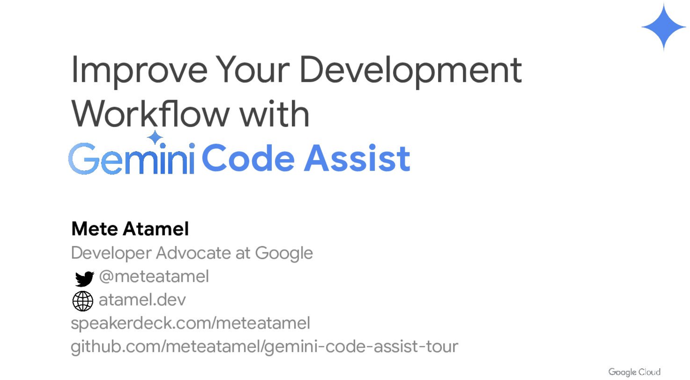

# A Tour of Gemini Code Assist

This repository contains a guided a tour of [Gemini Code
Assist](https://cloud.google.com/products/gemini/code-assist) for AI-assisted
application development.

More specifically, you will use Gemini Code Assist in [Cloud
Code](https://cloud.google.com/code) IDE plugin in Visual Studio Code to design
and create an application, explain, run, generate, test code, and more. You can
see the final application in the [app](./app/) folder.

> [!NOTE]
> The intake form for the newly announced **Full codebase awareness** and **Code
> Customization** features is here: [bit.ly/gemini-codeassist](https://bit.ly/gemini-codeassist)

## Slides

There's a
[presentation](https://speakerdeck.com/meteatamel/improve-your-development-workflow-with-gemini-code-assist)
that accompanies this repository.

## Steps

Follow the following steps:

* [Setup Gemini Code Assist](./docs/setup.md)
* [Design application](./docs/design-app.md)
* [Create application](./docs/create-app.md)
* [Explain code](./docs/explain-code.md)
* [Run code locally](./docs/run-code-locally.md)
* [Generate code](./docs/generate-code.md)
* [Generate tests](./docs/generate-tests.md)
* [Transform code](./docs/transform-code.md)
* [Deploy code](./docs/deploy-code.md)
* [Explain log entry](./docs/explain-log-entry.md)
