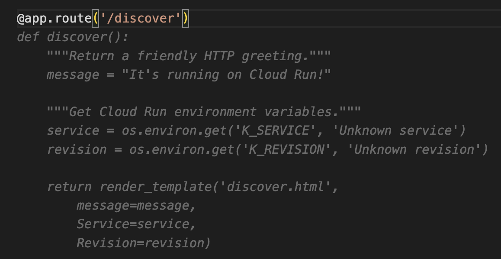
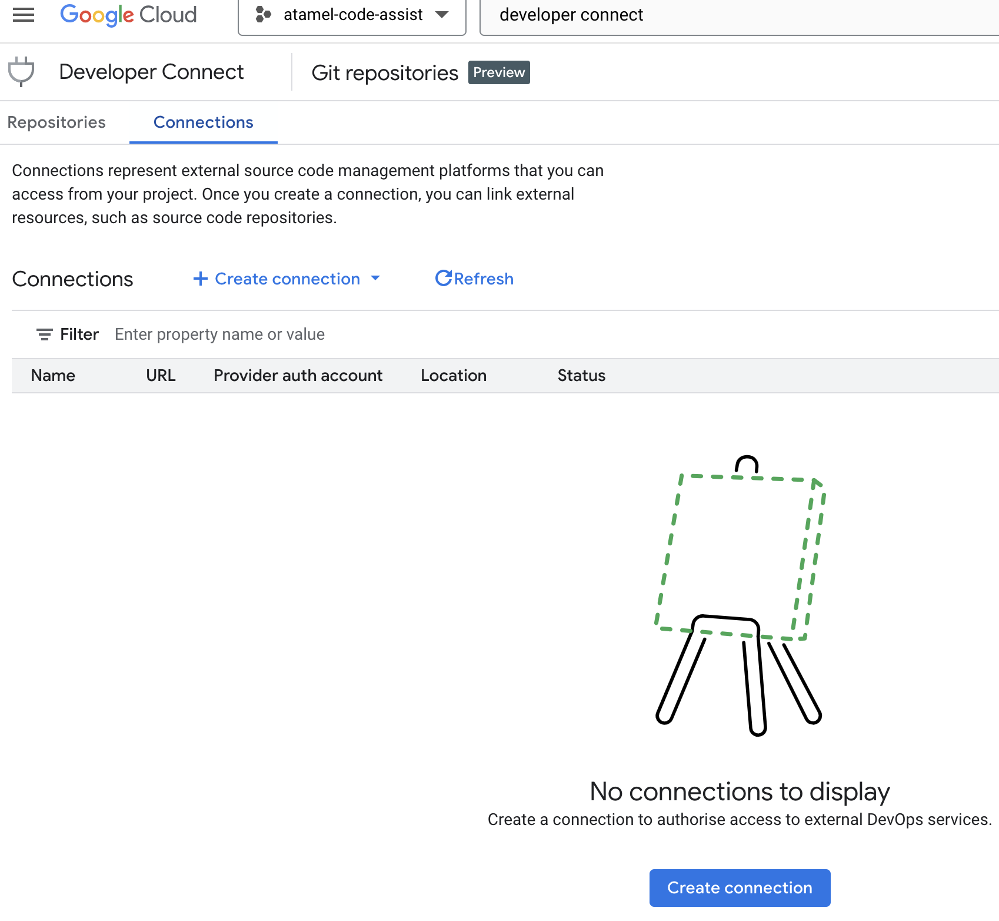
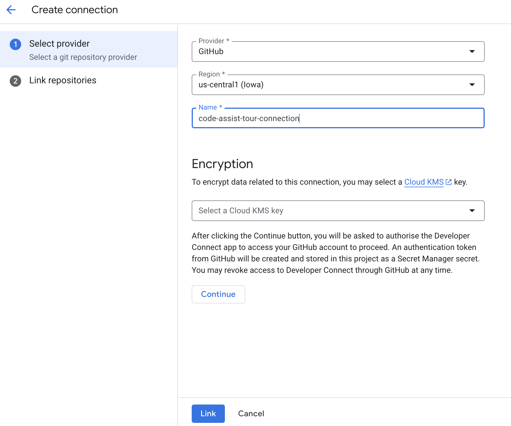
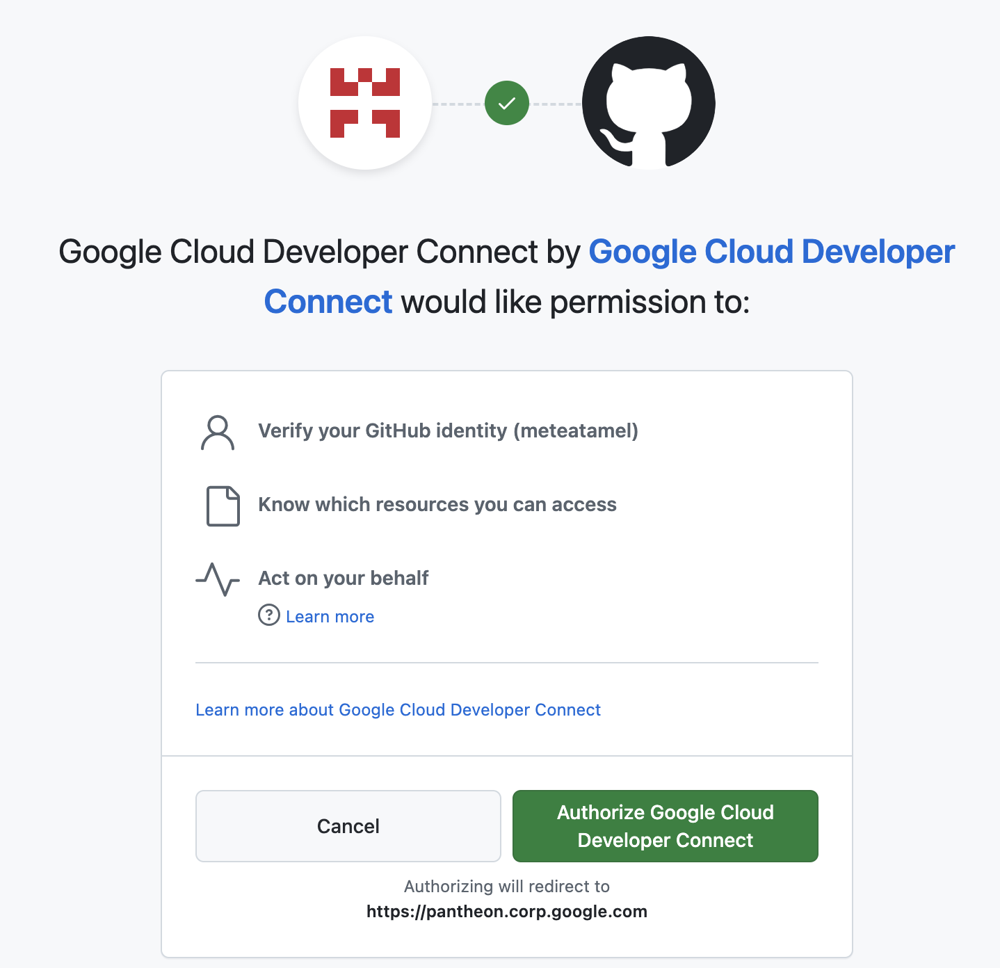
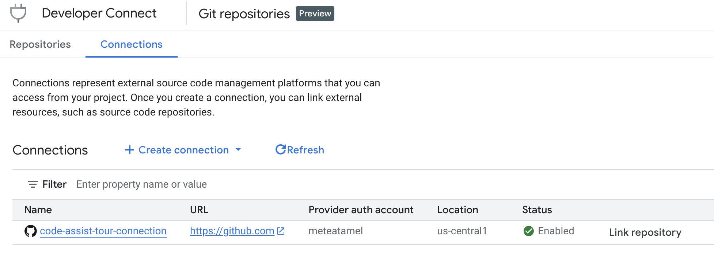
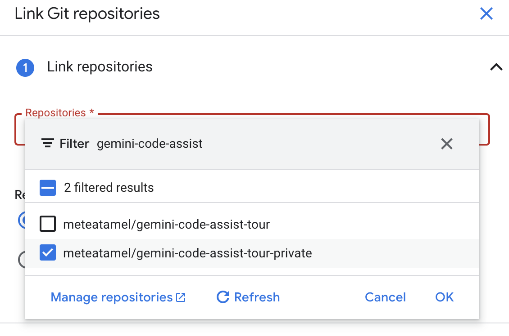
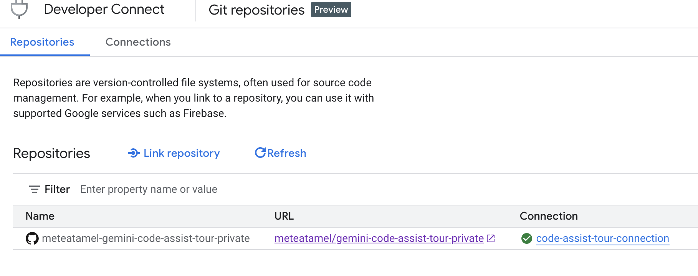
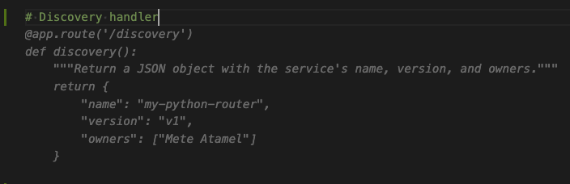
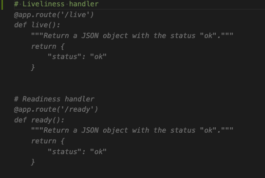

# Code customization

Code customization allows you to receive code recommendations which draw
from internal libraries, private APIs, and coding style of your organization.

## Without code customization

Let's first see what happens without code customization.

Imagine you have a standard set of HTTP handlers for discovery, liveliness, and readiness
that you want all your services to have. Something like this:

```python
import os
from flask import Flask, jsonify

app = Flask(__name__)

# Standard HTTP handlers

# Discovery handler
@app.route('/discover')
def discovery():
    return jsonify({
        "name": "my-python-router",
        "version": "v1",
        "owners": ["Mete Atamel"]
    })

# Liveliness handler
@app.route('/live')
def live():
    return jsonify({
        "status": "ok"
    })

# Readiness handler
@app.route('/ready')
def ready():
    return jsonify({
        "status": "ok"
    })

@app.route('/')
def hello_world():
    return "Hello, world!"


if __name__ == '__main__':
    server_port = os.environ.get('PORT', '8080')
    app.run(debug=True, port=server_port, host='0.0.0.0')
```

Can Code Assist suggest these standard handlers?

Go back to [app.py](../app/app.py) and try to add a discovery handler. You'll
probably get something random like this one:



Let's enable code customization now with a private GitHub repo and see what happens.

## Enable Gemini Code Assist

First, make sure you read through [Set up Gemini Code Assist code
customization](https://cloud.devsite.corp.google.com/gemini/docs/codeassist/code-customization)
documentation page. You need to make sure you're admin/owner of your project and
Gemini Code Assist is enabled which you can do as follows:

```shell
gcloud services enable cloudaicompanion.googleapis.com
```

## Configure Developer Connect

Next, Configure [Developer
Connect](https://cloud.google.com/developer-connect/docs/overview)
to connect to your GitHub (or GitLab) repository.

For this tutorial, create a private GitHub repo, let's call it
`gemini-code-assist-tour-private` and create an `app.py` file with your standard HTTP handlers.

You can follow [Connect a source code
repository](https://cloud.google.com/developer-connect/docs/connect-repo)
documentation page to connect to the private GitHub repo or follow the steps
below.

Enable the Developer Connect and Secret Manager APIs:

```shell
gcloud services enable developerconnect.googleapis.com
gcloud services enable secretmanager.googleapis.com
```

Go to Developer Connect and select `Create connection`:



Give your connection a name and choose GitHub:



You'll see a pop-up to authorize Developer Connect:



In the end, you should see the connection active:



Now, choose `Link repository` and link to the private repository you created
earlier: 



In the end, you should see your repository linked:



## Create a code repository index and group

Now, you're ready to create a code repository index:

```shell
gcloud gemini code-repository-indexes create gemini-code-assist-tour-index --location=us-central1
```

This will take some time. Once it's done, connect GitHub repositories to a group and link to the index:

```shell
gcloud gemini code-repository-indexes repository-groups create gemini-code-assist-tour-group \
    --location=us-central1 \
    --code-repository-index=gemini-code-assist-tour-index \
    --repositories='[{"resource": "https://developerconnect.googleapis.com/v1/projects/atamel-code-assist/locations/us-central1/connections/code-assist-tour-connection/gitRepositoryLinks/meteatamel-gemini-code-assist-tour-private", "branchPattern": "main"}]'
```

After this, you have to wait for a day or so for indexing to kick-in. 

## With code customization

After a day or so, let's go back to [app.py](../app/app.py) and try to add a
discovery handler. Notice how you're now getting suggestions in line with your
code conventions in your private GitHub repo:



Let's try adding liveliness handler as well with a comment:



Notice how we got both liveliness and readiness handlers as code suggestions. Nice!
