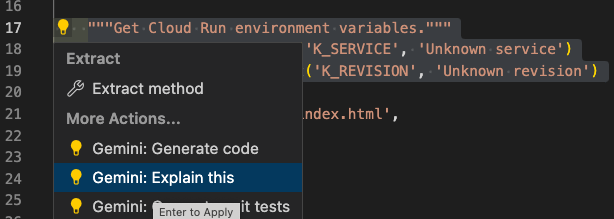
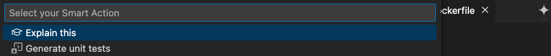

# Explain code

Once you have an application, you can use Gemini Code Assist to explain the code
and understand how it works. Let's try some prompts.

**Prompt**
> Explain app.py

**Answer**
<blockquote>
The `app.py` file is a Python script that defines a simple web application using the Flask microframework. This application serves a static HTML page with a message and some environment variables.

Here's a breakdown of the code:

1. Flask Application:

    * The app = Flask(__name__) line creates a Flask application instance.

1. Route Definition:

    * The @app.route('/') decorator defines a route for the root URL (/).

1. Hello View Function:

    * The hello() function is the view function for the root route. It returns an HTML response with a message and some environment variables.

1. Environment Variables:

    * The os.environ.get('K_SERVICE', 'Unknown service') and os.environ.get('K_REVISION', 'Unknown revision') lines retrieve environment variables set by the Cloud Run platform. These variables provide information about the service and its revision.

1. HTML Template:

    * The render_template('index.html', message=message, Service=service, Revision=revision) line renders the index.html template with the specified variables.

1. Main Function:

    * The if __name__ == '__main__' block is the entry point of the application.
    * It sets the server port from the PORT environment variable or defaults to 8080.
    * It runs the application in debug mode set to False, binds it to all IP addresses (0.0.0.0), and listens on the specified port.

When you deploy this application to Cloud Run, it will serve the index.html page with the message "It's running!" and the Cloud Run service and revision information.
</blockquote>

That's pretty good answer.

You can also select a block of code and ask Gemini to explain it as follows:



This will generate the following prompt and answer.

**Prompt**
<blockquote>
Explain this

```python
    """Get Cloud Run environment variables."""
    service = os.environ.get('K_SERVICE', 'Unknown service')
    revision = os.environ.get('K_REVISION', 'Unknown revision')
```
</blockquote>

**Answer**
<blockquote>
The selected code snippet, service = os.environ.get('K_SERVICE', 'Unknown service') and revision = os.environ.get('K_REVISION', 'Unknown revision'), retrieves environment variables set by the Cloud Run platform. These variables provide information about the service and its revision.

* `K_SERVICE`: This environment variable contains the name of the Cloud Run service.
* `K_REVISION`: This environment variable contains the revision number of the Cloud Run service.

The `os.environ.get()` function is used to retrieve the values of these environment variables. If the environment variable is not set, the default value ('Unknown service' or 'Unknown revision') is returned.

These environment variables are useful for identifying the specific instance of your Cloud Run service that is handling a request. They can be used for logging, debugging, or other purposes.

In the context of the `app.py` script, these environment variables are retrieved and passed to the `index.html` template, where they can be displayed to the user. This allows you to easily display information about the running Cloud Run service in your web application.
</blockquote>

You can also explain `Dockerfile`, this time triggering from top level menu:



This will generate the following prompt and answer.

**Prompt**
> Explain this

**Answer**
<blockquote>
The provided Dockerfile defines the instructions for building a Docker image that will run your Python web application. Let's break down each line:

1. `FROM python:3.12-alpine`: This line specifies the base image for your Docker image. It uses the official Python image with Alpine Linux as the base operating system. Alpine Linux is a lightweight and security-focused Linux distribution, making it a good choice for container images.

1. `WORKDIR /app`: This line sets the working directory inside the container to` /app`. This is where your application code and other files will be located.

1. `COPY requirements.txt .`: This line copies the requirements.txt file from your local machine into the container at the current working directory (/app). The `requirements.txt` file contains a list of Python packages that your application depends on.

1. `RUN pip install --trusted-host pypi.python.org -r requirements.txt`: This line installs the Python packages specified in the requirements.txt file. The --trusted-host pypi.python.org option is used to trust the PyPI package index and avoid potential SSL certificate errors.

1. `COPY . .`: This line copies the rest of the files and directories from your local working directory into the container at the current working directory (/app). This includes your application code and any other necessary files.

1. `ENTRYPOINT ["python", "app.py"]`: This line specifies the entry point command for the container. When the container starts, it will run the python app.py command. This command will execute your Python application, which is defined in the app.py file.

In summary, this Dockerfile defines the steps to create a Docker image that contains your Python application and its dependencies. When you build and run this image, it will create a container that can run your web application.
</blockquote>
