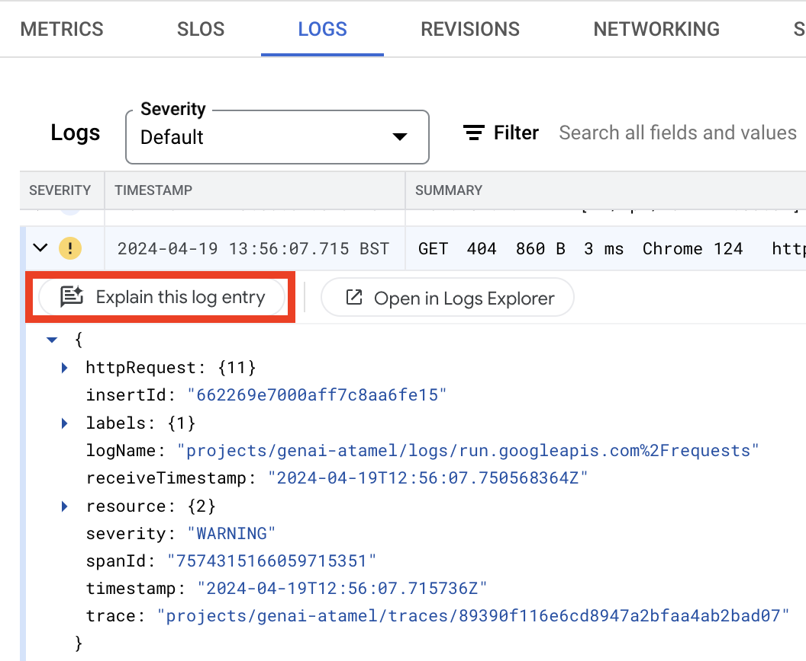
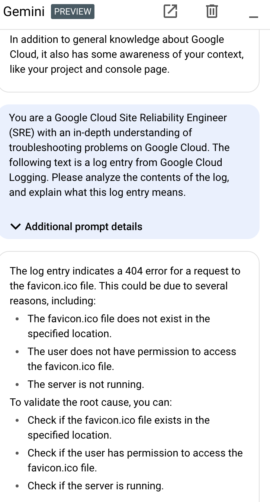

# Explain log entry

Once you have a Cloud Run service deployed, you can use Gemini to explain
the log entries of the application.

Go to the Cloud Run Logs section and pick a log entry:

This should open up the Gemini chat in Google Cloud Console with an explanation:

