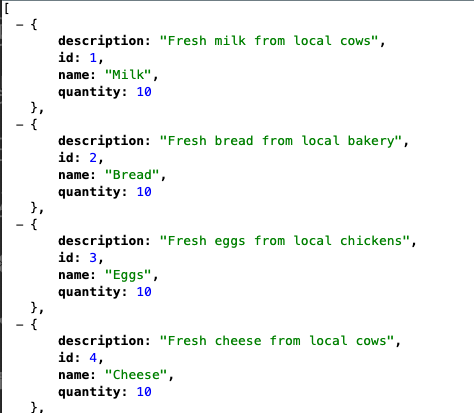
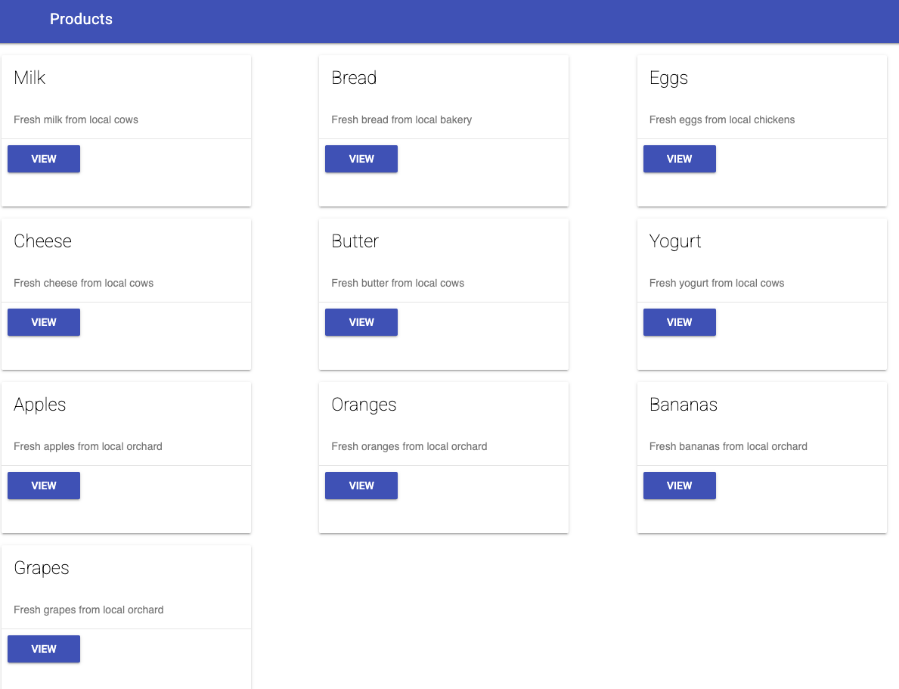

# Generate Code

It's time to see if Gemini can help us to add new functionality by generating
code.

## Create a new service

Create a `product_service.py` file and a new `ProductService` class:

```python
class ProductService:
```

Inside the class, add the following comment as a prompt to Gemini:

```python
# Create a constructor with a _products variable with a list of 10 products for a supermarket
# Each product should have an id, name, description, and quantity
```

From the comment, Gemini Code Assist should generate some code (or you can
`Ctrl+Enter` to manually trigger it). You should see code similar to the
following:

```python
class ProductService:

   def __init__(self):
    self._products = [
        {'id': 1, 'name': 'Milk', 'description': '1 gallon of milk', 'quantity': 10},
        {'id': 2, 'name': 'Bread', 'description': '1 loaf of bread', 'quantity': 20},
        {'id': 3, 'name': 'Eggs', 'description': '1 dozen eggs', 'quantity': 30},
        {'id': 4, 'name': 'Cheese', 'description': '1 block of cheese', 'quantity': 40},
        {'id': 5, 'name': 'Yogurt', 'description': '1 container of yogurt', 'quantity': 50},
        {'id': 6, 'name': 'Apples', 'description': '1 pound of apples', 'quantity': 60},
        {'id': 7, 'name': 'Bananas', 'description': '1 pound of bananas', 'quantity': 70},
        {'id': 8, 'name': 'Oranges', 'description': '1 pound of oranges', 'quantity': 80},
        {'id': 9, 'name': 'Tomatoes', 'description': '1 pound of tomatoes', 'quantity': 90},
        {'id': 10, 'name': 'Potatoes', 'description': '1 pound of potatoes', 'quantity': 100}
    ]
```

You might also get extra method generated:

```python
    # Create a method get_products that returns the _products variable
    def get_products(self):
        return self._products

    # Create a method get_product_by_id that takes an id as an argument and returns the product with that id
    def get_product_by_id(self, id):
        for product in self._products:
            if product['id'] == id:
                return product
        return None
```

Go ahead and add update and delete methods too with comments and letting Gemini
generate the rest:

```python
    # Update product
    def update_product(self, product):
        for i, p in enumerate(self._products):
            if p['id'] == product['id']:
                self._products[i] = product
                return True
        return False

    # Delete product
    def delete_product(self, id):
        for i, product in enumerate(self._products):
            if product['id'] == id:
                del self._products[i]
                return True
        return False
```

That's pretty good! Next, let's add a route to this service from `app.py` file.

## Create a new route

Inside `app.py`, add the following code:

```python
@app.route('/products_json')
def products_json():
    """Return a raw JSON list of products using ProductService in product_service.py"""
```

At this point, Gemini will fill the rest and you should have something like
this:

```python
@app.route('/products_json')
def products_json():
    """Return a raw JSON list of products using ProductService in product_service.py"""
    from product_service import ProductService
    product_service = ProductService()
    return product_service.get_products()
```

Test the `/products_json` route, you should see a JSON list of products:



## Create a new template

Nice! Now, let's create a frontend for this new route. Create `products.html`
under `templates` folder.

Enter the following comment for Gemini:

```html
<!-- Create an HTML page that displays products from product_service.py using material
design. It should display each product name, description, and quantity in a card in a grid layout.
 -->
```

And this should generate some HTML:

```html
<!DOCTYPE html>
<html lang="en">
<head>
  <meta charset="UTF-8">
  <meta name="viewport" content="width=device-width, initial-scale=1.0">
  <title>Products</title>
  <link rel="stylesheet" href="https://fonts.googleapis.com/icon?family=Material+Icons">
  <link rel="stylesheet" href="https://code.getmdl.io/1.3.0/material.indigo-pink.min.css">
  <script defer src="https://code.getmdl.io/1.3.0/material.min.js"></script>
</head>
<body>
  <div class="mdl-layout mdl-js-layout mdl-layout--fixed-header">
    <header class="mdl-layout__header">
      <div class="mdl-layout__header-row">
        <!-- Title -->
        <span class="mdl-layout-title">Products</span>
      </div>
    </header>
    <main class="mdl-layout__content">
      <div class="page-content">
        <div class="mdl-grid">
          
          <div class="mdl-cell mdl-cell--4-col">
            <div class="mdl-card mdl-shadow--2dp">
              <div class="mdl-card__title">
                <h2 class="mdl-card__title-text">{{ product.name }}</h2>
              </div>
              <div class="mdl-card__supporting-text">
                {{ product.description }}
              </div>
              <div class="mdl-card__actions mdl-card--border">
                <a href="/products/{{ product.id }}" class="mdl-button mdl-button--primary mdl-js-button mdl-button--raised">
                  View
                </a>
              </div>
            </div>
          </div>
          
        </div>
      </div>
    </main>
  </div>
</body>
</html>
```

## Create another route

Go back to `app.py` to use the template. Inside `app.py`, create a
new route for the template:

```python
@app.route('/products_template/')
def products_template():
    """Return a template list of products using ProductService in product_service.py"""
```

Gemini should fill the rest:

```python
@app.route('/products_template/')
def products_template():
    """Return a template list of products using ProductService in product_service.py"""
    from product_service import ProductService
    product_service = ProductService()
    return render_template('products.html', products=product_service.get_products())
```

Test the `/products_template` route, you should see a basic frontend:



We create a new service with test data and a new template for it, all with the
help of Gemini. That's pretty cool!
