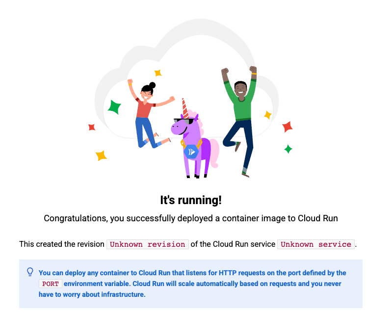

# Run code locally

It's time to run the code locally. Let's see what kind of help we can get
from Gemini.

**Prompt**
> How can I run app.py with flask command?

**Answer**
<blockquote>

To run the `app.py` script using the Flask command, you can use the following steps:

1. Ensure that you have Python and Flask installed on your system.
1. Navigate to the directory where your `app.py` script is located.
1. Open a terminal or command prompt.
1. Run the following command: `flask run`

</blockquote>

If you follow the instructions and run the application, you should see the
default Cloud Run page:

That's great but if you make any changes to `app.py`, it doesn't automatically
update in the browsers. Can we have hot-reloading?

**Prompt**
> Is there a command line flag for flask hot reload?

**Answer**
<blockquote>

While there isn't a dedicated command-line flag specifically named "hot reload"
in Flask, you can achieve the desired behavior using the `--debug` flag or by
setting the `FLASK_ENV` environment variable to development

1. Using the --debug flag:

`flask run --debug`
</blockquote>

Now, you can try running the app with `flask run --debug` and when you change
the `message = "It's running!"` in `app.py` to `message = "It's running on Cloud
Run!"`, it should automatically updated in the browser.
