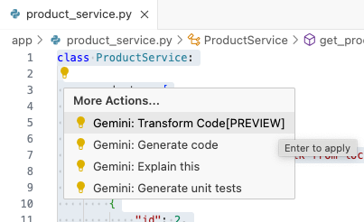
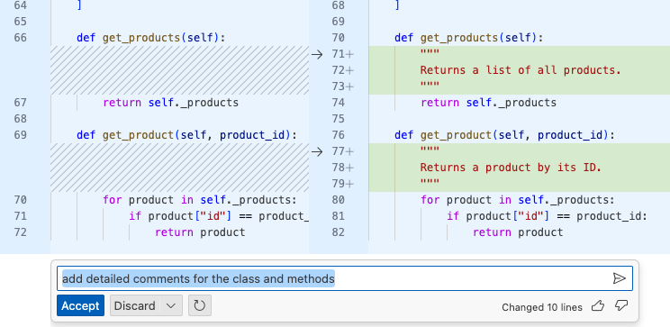

# Transform code

Gemini Code Assist has a new feature (in preview and only available on Cloud
Shell Editor for now) to transform code. Let's see if we can use it to add
comments to a class.

In Cloud Shell Editor, open `product_service.py`, select all the code, and
choose the transform code option:

In the text, enter `Add detailed comments for the class and methods`.

This should open up a diff window where you can see the transformed code and
accept or decline it:

