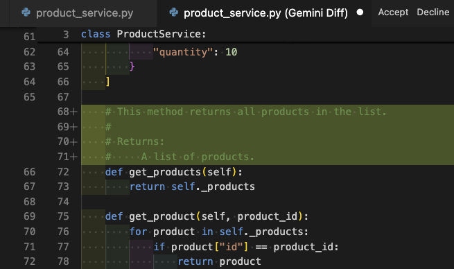

# Transform code

Gemini Code Assist has a new feature to transform code and provide you with a
diff view to show pending changes to your code.

Open `product_service.py`, and press `Control+I` or `Command+I` to open the
Quick Pick bar. Select `/fix` and type `/fix add detailed comments to all methods`

In the text, enter `Add detailed comments for the class and methods`.

This should open up a diff window where you can see the transformed code and
accept or decline it:

